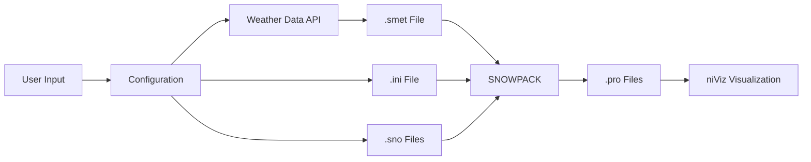

# Code Recommendations for SNOWPACKforPatrollers.ipynb

This document provides specific, actionable code improvements for the SNOWPACKforPatrollers notebook.

---

## Quick Wins (< 1 hour each)

### 1. Define Constants

**Issue**: Magic numbers scattered throughout code (273.15, -777, -9999, 0.3048, etc.)

**Solution**: Create constants section at top of notebook

```python
# ============================================================
# CONSTANTS
# ============================================================

# Physical constants
CELSIUS_TO_KELVIN = 273.15  # K
FEET_TO_METERS = 0.3048  # m/ft

# Data sentinel values
NODATA_VALUE = -777
SNODAS_NODATA = -9999

# Default parameters
DEFAULT_TIMEZONE = 0  # UTC
DEFAULT_GROUND_TEMP_K = 273.15  # 0°C
DEFAULT_SOIL_ALBEDO = 0.09
DEFAULT_BARE_SOIL_Z0 = 0.020  # m
DEFAULT_CALCULATION_STEP = 30.0  # minutes

# Geographic bounds (CONUS for SNODAS)
SNODAS_LAT_MIN = 24.95
SNODAS_LAT_MAX = 52.88
SNODAS_LON_MIN = -124.74
SNODAS_LON_MAX = -66.94

# Time parameters
DATA_BUFFER_DAYS = 2  # Days of data before simulation start
```

**Usage example:**
```python
# Before
df["TSG"] = 273.15

# After
df["TSG"] = DEFAULT_GROUND_TEMP_K
```

**Benefit**: Makes code self-documenting, easier to modify, and prevents typos

---

### 2. Add Input Validation Function

**Issue**: User inputs not validated until they cause errors

**Solution**: Add comprehensive validation with helpful messages

```python
def validate_configuration(config: dict) -> tuple[bool, list[str]]:
    """Validate user configuration and return (is_valid, error_messages).
    
    Args:
        config: Dictionary containing all configuration parameters
        
    Returns:
        Tuple of (is_valid: bool, messages: list[str])
        messages contains errors (❌) and warnings (⚠️)
    """
    messages = []
    is_valid = True
    
    # Latitude validation
    lat = config['latitude']
    if not (-90 <= lat <= 90):
        messages.append(f"❌ ERROR: Latitude {lat}° is invalid (must be -90 to 90)")
        is_valid = False
    elif not (SNODAS_LAT_MIN <= lat <= SNODAS_LAT_MAX):
        messages.append(f"⚠️ WARNING: Latitude {lat}° is outside CONUS - SNODAS data unavailable")
    
    # Longitude validation
    lon = config['longitude']
    if not (-180 <= lon <= 180):
        messages.append(f"❌ ERROR: Longitude {lon}° is invalid (must be -180 to 180)")
        is_valid = False
    elif not (SNODAS_LON_MIN <= lon <= SNODAS_LON_MAX):
        messages.append(f"⚠️ WARNING: Longitude {lon}° is outside CONUS - SNODAS data unavailable")
    
    # Altitude validation
    alt = config['altitude']
    alt_unit = config['altitude_unit']
    if alt < 0:
        messages.append(f"❌ ERROR: Altitude cannot be negative ({alt} {alt_unit})")
        is_valid = False
    else:
        alt_m = to_meters(alt, alt_unit)
        if alt_m > 9000:
            messages.append(f"⚠️ WARNING: Very high altitude ({alt_m:.0f}m) - check if correct")
        elif alt_m < 500:
            messages.append(f"⚠️ WARNING: Low altitude ({alt_m:.0f}m) for avalanche terrain")
    
    # Date validation
    try:
        start = datetime.strptime(config['start_date'], "%Y-%m-%d")
        end = datetime.strptime(config['end_date'], "%Y-%m-%d")
        
        if start >= end:
            messages.append(f"❌ ERROR: start_date must be before end_date")
            is_valid = False
        
        days_diff = (end - start).days
        if days_diff > 365:
            messages.append(f"⚠️ WARNING: Long simulation ({days_diff} days) may take significant time")
        elif days_diff < 30:
            messages.append(f"⚠️ WARNING: Short simulation ({days_diff} days) - consider longer period")
            
    except ValueError as e:
        messages.append(f"❌ ERROR: Invalid date format - {e}")
        is_valid = False
    
    # Slope configuration validation
    has_slopes = any([
        config.get('north_slope'),
        config.get('east_slope'),
        config.get('south_slope'),
        config.get('west_slope'),
        config.get('include_flat'),
        config.get('custom_directions', '').strip()
    ])
    
    if not has_slopes:
        messages.append("❌ ERROR: No slopes configured - enable at least one slope")
        is_valid = False
    
    slope_angle = config.get('default_slope_angle', 38.0)
    if slope_angle < 0 or slope_angle > 60:
        messages.append(f"⚠️ WARNING: Unusual slope angle ({slope_angle}°) - typical range is 30-45°")
    
    # Station ID validation
    station_id = config['station_id']
    if not station_id or not station_id.strip():
        messages.append("❌ ERROR: station_id cannot be empty")
        is_valid = False
    elif ' ' in station_id:
        messages.append("⚠️ WARNING: station_id contains spaces - may cause file naming issues")
    
    return is_valid, messages


# Usage in notebook
config = {
    'latitude': latitude,
    'longitude': longitude,
    'altitude': altitude,
    'altitude_unit': altitude_unit,
    'start_date': start_date,
    'end_date': end_date,
    'station_id': station_id,
    'north_slope': north_slope,
    'east_slope': east_slope,
    'south_slope': south_slope,
    'west_slope': west_slope,
    'include_flat': include_flat,
    'default_slope_angle': default_slope_angle,
    'custom_directions': custom_directions,
}

is_valid, messages = validate_configuration(config)

# Print results
if messages:
    print("\n" + "=" * 60)
    print("CONFIGURATION VALIDATION")
    print("=" * 60)
    for msg in messages:
        print(msg)
    print("=" * 60 + "\n")

if not is_valid:
    raise ValueError("Configuration validation failed. Please fix errors above.")
```

---

### 3. Improve Error Messages

**Issue**: Generic error messages don't help users fix problems

**Solution**: Replace generic errors with specific, actionable messages

```python
# Before
try:
    with open(sno_filepath, "w") as f:
        f.write(sno_content)
except Exception as e:
    print(f"Error writing {sno_filepath}: {e}")
    continue

# After
try:
    with open(sno_filepath, "w") as f:
        f.write(sno_content)
    print(f"   ✓ Created {os.path.basename(sno_filepath)}")
except PermissionError:
    print(f"   ❌ ERROR: Permission denied writing to {sno_filepath}")
    print(f"      Check directory permissions for {os.path.dirname(sno_filepath)}")
    continue
except OSError as e:
    print(f"   ❌ ERROR: Cannot write to {sno_filepath}")
    print(f"      {e}")
    print(f"      Check if disk is full or path is valid")
    continue
except Exception as e:
    print(f"   ❌ ERROR: Unexpected error writing {sno_filepath}")
    print(f"      {type(e).__name__}: {e}")
    continue
```

---

### 4. Add Type Hints to All Functions

**Issue**: Not all functions have type hints, making IDE support weaker

**Solution**: Add complete type hints

```python
from typing import Optional, List, Tuple, Dict
import pandas as pd
from datetime import datetime

def create_smet_from_weather_data(
    weather_df: pd.DataFrame,
    output_path: str,
    station_id: str,
    station_name: str,
    latitude: float,
    longitude: float,
    altitude_meters: float,
    timezone: float = 0
) -> None:
    """Create a SMET file from a weather DataFrame and write it to disk.
    
    Args:
        weather_df: DataFrame containing weather data with timestamp column
        output_path: Path where SMET file will be written
        station_id: Station identifier (no spaces recommended)
        station_name: Human-readable station name
        latitude: Latitude in decimal degrees (-90 to 90)
        longitude: Longitude in decimal degrees (-180 to 180)
        altitude_meters: Altitude in meters above sea level
        timezone: Timezone offset in hours (default: 0 for UTC)
        
    Returns:
        None - file is written to disk
        
    Raises:
        ValueError: If required columns are missing from weather_df
        OSError: If output_path cannot be written
        
    Example:
        >>> df = pd.DataFrame({
        ...     'timestamp': pd.date_range('2024-01-01', periods=24, freq='H'),
        ...     'TA': [273.15] * 24,
        ...     'RH': [0.8] * 24,
        ...     # ... other columns
        ... })
        >>> create_smet_from_weather_data(
        ...     df, 'output.smet', 'TEST', 'Test Station',
        ...     40.0, -105.0, 3000.0
        ... )
    """
    # Validate required columns
    required_cols = ['timestamp', 'TA', 'RH', 'TSG', 'VW', 'DW', 'ISWR', 'PSUM']
    missing_cols = [col for col in required_cols if col not in weather_df.columns]
    if missing_cols:
        raise ValueError(f"Missing required columns: {missing_cols}")
    
    # ... rest of function
```

---

### 5. Add Progress Indicators

**Issue**: Long operations provide no feedback

**Solution**: Add simple progress indicators

```python
# At top of notebook (after imports)
from IPython.display import display, HTML, clear_output
import time

def print_progress(current: int, total: int, description: str = "", bar_length: int = 40):
    """Print a simple progress bar.
    
    Args:
        current: Current progress (0 to total)
        total: Total items
        description: Optional description to show
        bar_length: Length of progress bar in characters
    """
    percent = current / total
    filled = int(bar_length * percent)
    bar = '█' * filled + '░' * (bar_length - filled)
    print(f'\r{description} [{bar}] {current}/{total} ({percent*100:.1f}%)', end='', flush=True)
    if current == total:
        print()  # New line when complete


# Usage example
print("\nFetching SNODAS data for multiple dates...")
total_dates = len(unique_dates)
for i, date_str in enumerate(unique_dates, 1):
    print_progress(i, total_dates, f"Processing {date_str}")
    depth = get_snodas_snow_depth(latitude, longitude, date_str)
    if depth is not None:
        snodas_cache[date_str] = depth
    time.sleep(0.1)  # Brief pause to show progress
```

---

## Medium Complexity Changes (1-3 hours each)

### 6. Create Configuration Dataclass

**Issue**: Configuration parameters scattered as individual variables

**Solution**: Use a dataclass to group related configuration

```python
from dataclasses import dataclass, field
from typing import List

@dataclass
class SimulationConfig:
    """Configuration for SNOWPACK simulation."""
    
    # Station information
    station_id: str
    station_name: str
    latitude: float
    longitude: float
    altitude: float
    altitude_unit: str = "meters"
    
    # Time period
    start_date: str  # Format: YYYY-MM-DD
    end_date: str    # Format: YYYY-MM-DD
    profile_date: str = ""  # Will be set to start_date + T00:00:00 if empty
    
    # Slopes configuration
    num_slopes: int = 5
    default_slope_angle: float = 38.0
    include_flat: bool = True
    north_slope: bool = True
    east_slope: bool = True
    south_slope: bool = True
    west_slope: bool = True
    custom_directions: str = ""
    
    # Weather model
    model_selection: str = "ifs"  # Options: nbm, ifs, gfs, hrrr, nam
    hs_source: str = "model"  # Options: model, snodas
    
    # SNOWPACK settings
    meas_tss: str = "false"
    enforce_measured_snow_heights: str = "false"
    write_profiles: str = "true"
    write_timeseries: str = "false"
    write_snowpack: str = "false"
    
    # Coordinate system
    coord_sys: str = "UTM"
    coord_param: str = "13S"
    timezone: int = 0  # UTC
    
    # Paths
    sno_directory: str = "/content/input"
    ini_directory: str = "/content/config"
    
    def __post_init__(self):
        """Validate and compute derived values after initialization."""
        # Set profile_date to start_date if not specified
        if not self.profile_date:
            self.profile_date = f"{self.start_date}T00:00:00"
        
        # Convert altitude to meters
        self.altitude_meters = to_meters(self.altitude, self.altitude_unit)
    
    def to_dict(self) -> dict:
        """Convert configuration to dictionary for validation."""
        return {
            'station_id': self.station_id,
            'latitude': self.latitude,
            'longitude': self.longitude,
            'altitude': self.altitude,
            'altitude_unit': self.altitude_unit,
            'start_date': self.start_date,
            'end_date': self.end_date,
            'north_slope': self.north_slope,
            'east_slope': self.east_slope,
            'south_slope': self.south_slope,
            'west_slope': self.west_slope,
            'include_flat': self.include_flat,
            'default_slope_angle': self.default_slope_angle,
            'custom_directions': self.custom_directions,
        }
    
    def validate(self) -> tuple[bool, list[str]]:
        """Validate configuration."""
        return validate_configuration(self.to_dict())


# Usage in notebook
config = SimulationConfig(
    station_id=station_id,
    station_name=station_name,
    latitude=latitude,
    longitude=longitude,
    altitude=altitude,
    altitude_unit=altitude_unit,
    start_date=start_date,
    end_date=end_date,
    model_selection=model_selection,
    # ... other parameters
)

# Validate
is_valid, messages = config.validate()
if not is_valid:
    for msg in messages:
        print(msg)
    raise ValueError("Configuration validation failed")

# Access values
print(f"Station: {config.station_name} at {config.altitude_meters}m")
```

---

### 7. Break Down Step 3 Cell

**Issue**: 269-line cell is hard to debug and understand

**Solution**: Split into logical sub-cells

**Cell 3a: Generate Configuration Files**
```python
# @title Step 3a: Generate Configuration Files
print('[INFO] Generating configuration files...')

# Generate slopes configuration
slopes = generate_slopes(
    include_flat, north_slope, east_slope, south_slope, west_slope,
    custom_directions, default_slope_angle
)

# Create .sno and .ini files
main()  # This is the configuration generation function

# Create output directory
os.makedirs(os.path.join(ini_directory, 'output'), exist_ok=True)
print('[INFO] ✓ Configuration files created')
print(f'       {len(slopes)} virtual slopes configured')
```

**Cell 3b: Fetch Weather Data**
```python
# @title Step 3b: Fetch Weather Data
print('[INFO] Fetching weather data...')

# Model mapping
model_mapping = {
    "nbm": "ncep_nbm_conus",
    "ifs": "ecmwf_ifs",
    "gfs": "gfs_global",
    "nam": "gfs_nam_conus",
    "hrrr": "gfs_hrrr"
}

openmeteo_model = model_mapping[model_selection]

# Add 2-day buffer for SNOWPACK initialization
fetch_start_dt = datetime.strptime(start_date, "%Y-%m-%d") - timedelta(days=DATA_BUFFER_DAYS)
fetch_start_date = fetch_start_dt.strftime("%Y-%m-%d")

# Fetch data
df = fetch_openmeteo_historical(
    lat=latitude,
    lon=longitude,
    start_date=fetch_start_date,
    end_date=end_date,
    model=openmeteo_model,
    elevation=openmeteo_elevation
)

if df is None or df.empty:
    raise RuntimeError(f"Failed to fetch weather data for {model_selection}")

print(f'[INFO] ✓ Fetched {len(df)} hourly records')
print(f'       Period: {df["timestamp"].min()} to {df["timestamp"].max()}')
```

**Cell 3c: Integrate SNODAS (Optional)**
```python
# @title Step 3c: Integrate SNODAS Snow Depth (Optional)
if hs_source == "snodas":
    print('[INFO] Integrating SNODAS snow depth data...')
    
    # Get unique dates
    df['date_key'] = df['timestamp'].dt.strftime("%Y%m%d")
    unique_dates = df['date_key'].unique()
    
    print(f'       Fetching data for {len(unique_dates)} days...')
    snodas_cache = {}
    
    for i, date_str in enumerate(unique_dates, 1):
        print_progress(i, len(unique_dates), f"  SNODAS {date_str}")
        try:
            depth = get_snodas_snow_depth(latitude, longitude, date_str, debug=False)
            if depth is not None:
                snodas_cache[date_str] = depth
        except Exception as e:
            print(f"\n  ⚠️ Warning: Failed to fetch {date_str}: {e}")
    
    # Apply to dataframe
    if snodas_cache:
        snodas_series = df['date_key'].map(snodas_cache)
        valid_count = snodas_series.count()
        df['HS'] = snodas_series
        print(f'\n[INFO] ✓ Applied SNODAS data to {valid_count}/{len(df)} records')
    else:
        print('[WARN] No SNODAS data retrieved, using model snow depth')
else:
    print('[INFO] Using model snow depth (SNODAS disabled)')
```

**Cell 3d: Create SMET File**
```python
# @title Step 3d: Create SMET File
print('[INFO] Creating SMET meteorological file...')

output_file = os.path.join(sno_directory, f"{station_id}.smet")

create_smet_from_weather_data(
    weather_df=df,
    output_path=output_file,
    station_id=f"{station_id}_{model_selection}",
    station_name=f"{station_name}_{model_selection}",
    latitude=latitude,
    longitude=longitude,
    altitude_meters=altitude_meters,
    timezone=timezone
)

print(f'[INFO] ✓ SMET file created: {output_file}')
```

**Cell 3e: Run SNOWPACK**
```python
# @title Step 3e: Run SNOWPACK Simulation
print('[INFO] Running SNOWPACK simulation...')
print(f'       Configuration: {ini_filepath}')
print(f'       End date: {snowpack_end_date}')

# Find SNOWPACK executable
try:
    result = subprocess.run(["which", "snowpack"], capture_output=True, text=True, check=True)
    snowpack_executable = result.stdout.strip()
except (subprocess.CalledProcessError, FileNotFoundError):
    snowpack_executable = "snowpack"

# Verify configuration exists
if not os.path.exists(ini_filepath):
    raise FileNotFoundError(f"Configuration file not found: {ini_filepath}")

# Run SNOWPACK
start_time = time.time()
try:
    result = subprocess.run(
        [snowpack_executable, "-c", ini_filepath, "-e", snowpack_end_date],
        cwd=ini_directory,
        check=True,
        capture_output=True,
        text=True,
        timeout=600  # 10 minute timeout
    )
    elapsed = time.time() - start_time
    print(result.stdout)
    print(f'\n[INFO] ✓ SNOWPACK simulation complete ({elapsed:.1f}s)')
    
except subprocess.TimeoutExpired:
    print('[ERROR] SNOWPACK simulation timed out after 10 minutes')
    print('        Try reducing the simulation period or number of slopes')
    raise
    
except subprocess.CalledProcessError as e:
    print(f'\n[ERROR] SNOWPACK failed (exit code {e.returncode})')
    print('=' * 60)
    print('STDERR:')
    print(e.stderr)
    print('=' * 60)
    print('STDOUT:')
    print(e.stdout)
    print('=' * 60)
    raise
```

**Cell 3f: Download Results**
```python
# @title Step 3f: Download Results
print('[INFO] Packaging results...')

# Find .pro files
pro_files = glob.glob(os.path.join(ini_directory, 'output', '*.pro'))

if not pro_files:
    print('[WARN] No .pro files found in output directory')
    print(f'       Expected location: {os.path.join(ini_directory, "output")}')
else:
    print(f'[INFO] Found {len(pro_files)} profile files')
    
    # Create ZIP
    zip_filename = f'{station_id}_profiles.zip'
    zip_path = os.path.join(temp_dir, zip_filename)
    
    with zipfile.ZipFile(zip_path, 'w') as zipf:
        for pro_file in pro_files:
            filename = os.path.basename(pro_file)
            zipf.write(pro_file, filename)
            print(f'       ✓ {filename}')
    
    print(f'\n[INFO] ✓ Created {zip_filename}')
    
    # Download (Colab only)
    if IN_COLAB:
        files.download(zip_path)
        print('[INFO] ✓ Download started')
    else:
        print(f'[INFO] File available at: {zip_path}')
    
    # Show niViz instructions
    display(Markdown(f"""
    ## 🎉 Success!
    
    Your SNOWPACK simulation is complete. {len(pro_files)} profile files are ready to view.
    
    ### Next Steps:
    1. Go to **[niViz.org](https://run.niviz.org)**
    2. Drag and drop `{zip_filename}` (or individual .pro files) onto the page
    3. Use the timeline slider to explore snowpack evolution
    
    ### Files generated:
    {"".join([f"- `{os.path.basename(f)}`\\n    " for f in pro_files])}
    """))
```

---

### 8. Add Summary Statistics Function

**Issue**: No easy way to see what was simulated

**Solution**: Create a summary function

```python
def print_simulation_summary(config: SimulationConfig, df: pd.DataFrame, slopes: List[Tuple[float, float]]):
    """Print a comprehensive summary of the simulation configuration and data.
    
    Args:
        config: Simulation configuration
        df: Weather dataframe
        slopes: List of (angle, azimuth) tuples
    """
    print("\n" + "=" * 70)
    print(" " * 20 + "SIMULATION SUMMARY")
    print("=" * 70)
    
    # Location
    print("\n📍 LOCATION")
    print(f"   Station: {config.station_name} ({config.station_id})")
    print(f"   Coordinates: {config.latitude:.5f}°N, {config.longitude:.5f}°W")
    print(f"   Altitude: {config.altitude_meters:.0f}m ({config.altitude} {config.altitude_unit})")
    print(f"   Grid: {config.coord_sys} {config.coord_param}")
    
    # Time period
    print("\n📅 TIME PERIOD")
    start_dt = datetime.strptime(config.start_date, "%Y-%m-%d")
    end_dt = datetime.strptime(config.end_date, "%Y-%m-%d")
    days = (end_dt - start_dt).days
    print(f"   Start: {config.start_date}")
    print(f"   End: {config.end_date}")
    print(f"   Duration: {days} days")
    print(f"   Data records: {len(df)} hourly values")
    
    # Weather data
    print("\n🌤️  WEATHER DATA")
    print(f"   Model: {config.model_selection.upper()}")
    print(f"   Snow depth source: {config.hs_source.upper()}")
    if 'HS' in df.columns:
        hs_stats = df['HS'].describe()
        print(f"   Snow depth range: {hs_stats['min']:.2f} - {hs_stats['max']:.2f} m")
    
    temp_c = df['TA'] - CELSIUS_TO_KELVIN
    print(f"   Temperature range: {temp_c.min():.1f}°C to {temp_c.max():.1f}°C")
    print(f"   Total precipitation: {df['PSUM'].sum():.1f} mm")
    
    # Slopes
    print("\n⛰️  VIRTUAL SLOPES")
    print(f"   Total slopes: {len(slopes)}")
    for i, (angle, azimuth) in enumerate(slopes, 1):
        if angle == 0.0:
            print(f"   {i}. Flat terrain (0°)")
        else:
            direction = {0: "N", 90: "E", 180: "S", 270: "W"}.get(azimuth, f"{azimuth}°")
            print(f"   {i}. {angle}° slope facing {direction}")
    
    # Output
    print("\n📁 OUTPUT")
    print(f"   Configuration: {os.path.join(config.ini_directory, config.station_id + '.ini')}")
    print(f"   Weather data: {os.path.join(config.sno_directory, config.station_id + '.smet')}")
    print(f"   Profiles: {len(slopes)} .pro files in {os.path.join(config.ini_directory, 'output')}")
    
    print("\n" + "=" * 70 + "\n")


# Usage after configuration and data fetch
print_simulation_summary(config, df, slopes)
```

---

## Major Refactoring (3+ hours)

### 9. Extract to Python Package

Create proper package structure:

```
snowpack_utils/
├── __init__.py
├── constants.py
├── config.py
├── weather.py
├── smet.py
├── validation.py
└── utils.py
```

**`snowpack_utils/constants.py`:**
```python
"""Constants and default values for SNOWPACK simulations."""

# Physical constants
CELSIUS_TO_KELVIN = 273.15
FEET_TO_METERS = 0.3048

# Sentinel values
NODATA_VALUE = -777
SNODAS_NODATA = -9999

# Defaults
DEFAULT_TIMEZONE = 0
DEFAULT_GROUND_TEMP_K = 273.15
DEFAULT_SOIL_ALBEDO = 0.09
DEFAULT_BARE_SOIL_Z0 = 0.020
DEFAULT_CALCULATION_STEP = 30.0

# Geographic bounds
SNODAS_BOUNDS = {
    'lat_min': 24.95,
    'lat_max': 52.88,
    'lon_min': -124.74,
    'lon_max': -66.94
}

# Model mapping
WEATHER_MODELS = {
    "nbm": "ncep_nbm_conus",
    "ifs": "ecmwf_ifs",
    "gfs": "gfs_global",
    "nam": "gfs_nam_conus",
    "hrrr": "gfs_hrrr"
}
```

**`snowpack_utils/__init__.py`:**
```python
"""SNOWPACK utilities for Jupyter notebooks."""

__version__ = "1.0.0"

from .constants import *
from .config import generate_slopes, create_sno_content, create_ini_content
from .weather import fetch_openmeteo_historical, get_snodas_snow_depth
from .smet import create_smet_from_weather_data
from .validation import validate_configuration
from .utils import to_meters, print_progress, print_simulation_summary

__all__ = [
    # Constants
    'CELSIUS_TO_KELVIN', 'FEET_TO_METERS', 'NODATA_VALUE',
    'DEFAULT_TIMEZONE', 'DEFAULT_GROUND_TEMP_K',
    'SNODAS_BOUNDS', 'WEATHER_MODELS',
    
    # Config
    'generate_slopes', 'create_sno_content', 'create_ini_content',
    
    # Weather
    'fetch_openmeteo_historical', 'get_snodas_snow_depth',
    
    # SMET
    'create_smet_from_weather_data',
    
    # Validation
    'validate_configuration',
    
    # Utils
    'to_meters', 'print_progress', 'print_simulation_summary',
]
```

Then the notebook becomes:

```python
# @title Step 1: Install & Setup
print('[INFO] Installing dependencies...')

# System packages
!apt-get update -qq && apt-get install -y build-essential cmake git liblapack-dev numdiff

# Python packages
%pip install -q openmeteo-requests requests-cache retry-requests pandas numpy

# SNOWPACK binaries
!wget -q -O snowpack.deb https://gitlabext.wsl.ch/.../Snowpack-3.7.0-x86_64.deb
!dpkg -i --force-overwrite snowpack.deb
!apt-get install -f -y

# Install utilities package
!pip install -e /content/snowpack_utils

print('[INFO] ✓ Setup complete')
```

---

### 10. Add Jupyter Widgets for Interactive Configuration

**Issue**: Form fields are limited in functionality

**Solution**: Use ipywidgets for better UX

```python
import ipywidgets as widgets
from IPython.display import display

def create_configuration_ui():
    """Create interactive configuration UI using widgets."""
    
    # Station configuration
    station_id_widget = widgets.Text(
        value='watrous',
        description='Station ID:',
        tooltip='Unique identifier (no spaces recommended)'
    )
    
    station_name_widget = widgets.Text(
        value='watrous_E_NTL',
        description='Station Name:',
    )
    
    latitude_widget = widgets.FloatText(
        value=39.71438,
        description='Latitude:',
        step=0.00001,
        tooltip='Decimal degrees'
    )
    
    longitude_widget = widgets.FloatText(
        value=-105.84475,
        description='Longitude:',
        step=0.00001,
        tooltip='Decimal degrees'
    )
    
    altitude_widget = widgets.IntText(
        value=11800,
        description='Altitude:',
    )
    
    altitude_unit_widget = widgets.Dropdown(
        options=['meters', 'feet'],
        value='feet',
        description='Unit:',
    )
    
    # Date configuration
    start_date_widget = widgets.DatePicker(
        description='Start Date:',
        value=datetime.date(2024, 11, 1)
    )
    
    end_date_widget = widgets.DatePicker(
        description='End Date:',
        value=datetime.date(2025, 4, 30)
    )
    
    # Slopes configuration
    slope_angle_widget = widgets.FloatSlider(
        value=38.0,
        min=0,
        max=60,
        step=1.0,
        description='Slope Angle:',
        continuous_update=False,
        readout_format='.0f'
    )
    
    slope_checkboxes = widgets.VBox([
        widgets.Checkbox(value=True, description='Include Flat'),
        widgets.Checkbox(value=True, description='North Slope'),
        widgets.Checkbox(value=True, description='East Slope'),
        widgets.Checkbox(value=True, description='South Slope'),
        widgets.Checkbox(value=True, description='West Slope'),
    ])
    
    custom_directions_widget = widgets.Text(
        value='',
        placeholder='e.g., 45,135,225,315',
        description='Custom Azimuths:',
        tooltip='Comma-separated angles (0-360)'
    )
    
    # Weather model
    model_widget = widgets.Dropdown(
        options=['ifs', 'gfs', 'hrrr', 'nam', 'nbm'],
        value='ifs',
        description='Weather Model:',
    )
    
    hs_source_widget = widgets.Dropdown(
        options=['model', 'snodas'],
        value='model',
        description='Snow Depth:',
        tooltip='Source for snow depth data'
    )
    
    # Create tabs
    location_tab = widgets.VBox([
        station_id_widget,
        station_name_widget,
        widgets.HBox([latitude_widget, longitude_widget]),
        widgets.HBox([altitude_widget, altitude_unit_widget]),
    ])
    
    dates_tab = widgets.VBox([
        start_date_widget,
        end_date_widget,
    ])
    
    slopes_tab = widgets.VBox([
        slope_angle_widget,
        slope_checkboxes,
        custom_directions_widget,
    ])
    
    weather_tab = widgets.VBox([
        model_widget,
        hs_source_widget,
    ])
    
    tabs = widgets.Tab([location_tab, dates_tab, slopes_tab, weather_tab])
    tabs.set_title(0, '📍 Location')
    tabs.set_title(1, '📅 Dates')
    tabs.set_title(2, '⛰️ Slopes')
    tabs.set_title(3, '🌤️ Weather')
    
    # Validate button
    validate_button = widgets.Button(
        description='Validate Configuration',
        button_style='info',
        icon='check'
    )
    
    output = widgets.Output()
    
    def on_validate_click(b):
        with output:
            clear_output()
            config_dict = {
                'station_id': station_id_widget.value,
                'latitude': latitude_widget.value,
                'longitude': longitude_widget.value,
                'altitude': altitude_widget.value,
                'altitude_unit': altitude_unit_widget.value,
                'start_date': start_date_widget.value.strftime('%Y-%m-%d'),
                'end_date': end_date_widget.value.strftime('%Y-%m-%d'),
                'default_slope_angle': slope_angle_widget.value,
                # ... other values
            }
            is_valid, messages = validate_configuration(config_dict)
            if is_valid:
                print("✅ Configuration is valid!")
            for msg in messages:
                print(msg)
    
    validate_button.on_click(on_validate_click)
    
    # Display
    display(tabs, validate_button, output)
    
    # Return widget references for later access
    return {
        'station_id': station_id_widget,
        'station_name': station_name_widget,
        'latitude': latitude_widget,
        'longitude': longitude_widget,
        'altitude': altitude_widget,
        'altitude_unit': altitude_unit_widget,
        'start_date': start_date_widget,
        'end_date': end_date_widget,
        'slope_angle': slope_angle_widget,
        'model': model_widget,
        'hs_source': hs_source_widget,
    }

# Usage in notebook
widgets_dict = create_configuration_ui()
```

---

## Testing Recommendations

Since the notebook currently has no tests, consider adding:

```python
# Add at end of notebook (optional cell for developers)
# @title Developer: Run Tests (Optional)

def test_generate_slopes():
    """Test slope generation."""
    slopes = generate_slopes(True, True, False, False, False, "", 38.0)
    assert len(slopes) == 2, f"Expected 2 slopes, got {len(slopes)}"
    assert slopes[0] == (0.0, 0.0), "First should be flat"
    assert slopes[1] == (38.0, 0.0), "Second should be north"
    print("✓ test_generate_slopes passed")

def test_to_meters():
    """Test unit conversion."""
    assert abs(to_meters(1000, "meters") - 1000.0) < 0.01
    assert abs(to_meters(3280.84, "feet") - 1000.0) < 0.01
    print("✓ test_to_meters passed")

def test_validate_configuration():
    """Test configuration validation."""
    valid_config = {
        'latitude': 40.0,
        'longitude': -105.0,
        'altitude': 3000,
        'altitude_unit': 'meters',
        'start_date': '2024-01-01',
        'end_date': '2024-12-31',
        'station_id': 'test',
        'north_slope': True,
        'east_slope': False,
        'south_slope': False,
        'west_slope': False,
        'include_flat': False,
        'default_slope_angle': 38.0,
        'custom_directions': '',
    }
    is_valid, messages = validate_configuration(valid_config)
    assert is_valid, f"Valid config failed: {messages}"
    print("✓ test_validate_configuration passed")

# Run tests
try:
    test_generate_slopes()
    test_to_meters()
    test_validate_configuration()
    print("\n✅ All tests passed!")
except AssertionError as e:
    print(f"\n❌ Test failed: {e}")
```

---

## Documentation Improvements

### Add a "How It Works" diagram

```markdown
## How This Notebook Works



### Add parameter reference

```markdown
## Parameter Reference

| Parameter | Type | Range | Default | Description |
|-----------|------|-------|---------|-------------|
| `latitude` | float | -90 to 90 | 39.71 | Decimal degrees north |
| `longitude` | float | -180 to 180 | -105.84 | Decimal degrees east |
| `altitude` | int | > 0 | 11800 | Elevation (in specified units) |
| `altitude_unit` | str | meters, feet | feet | Unit for altitude |
| `slope_angle` | float | 0 to 60 | 38.0 | Slope steepness in degrees |
| `model_selection` | str | ifs, gfs, hrrr, nam, nbm | ifs | Weather forecast model |
| `hs_source` | str | model, snodas | model | Snow depth data source |
```

---

## Summary

These recommendations prioritize:
1. **Quick wins** that improve UX with minimal effort
2. **Medium changes** that improve code maintainability
3. **Major refactoring** for long-term sustainability

The most impactful changes are:
- Adding constants (30 min, huge readability improvement)
- Input validation (1-2 hours, prevents errors)
- Progress indicators (30 min, better UX)
- Breaking Step 3 into sub-cells (1 hour, easier debugging)
- Creating a Python package (3+ hours, professional-grade organization)

All changes maintain backward compatibility and don't break existing functionality.
